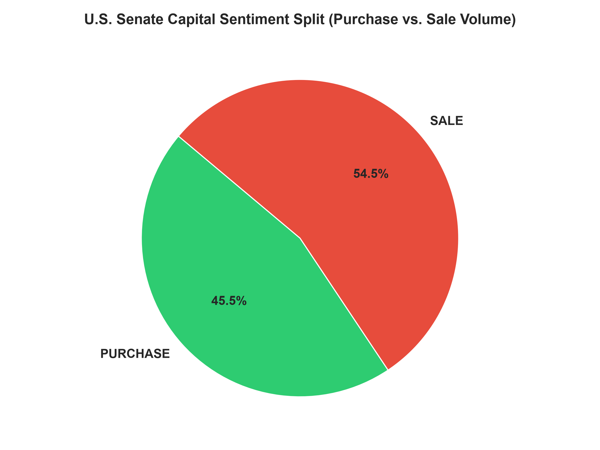
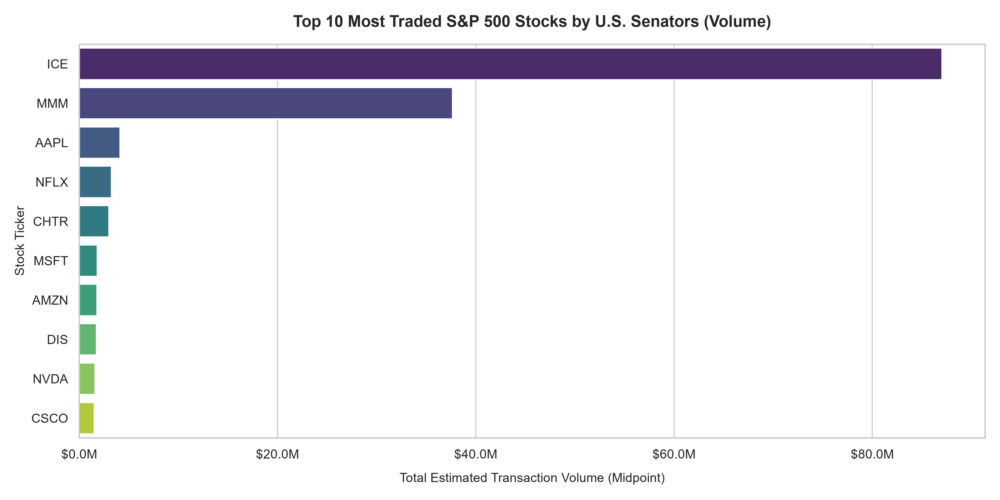
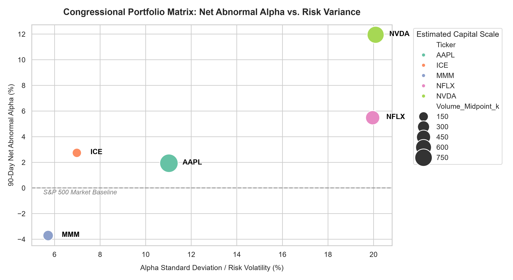

# Senate-Insider-Trading-Analysis

Capstone Project: A Python data pipeline analyzing U.S. Senate financial disclosures under the STOCK Act. Evaluates net abnormal alpha and market timing consistency against the S&P 500 baseline using the Google Data Analytics framework.

---

## Table of Contents
1. About This Project
2. Key Results
3. Ask Phase: Business Task & Objectives
4. Prepare Phase: Data Sources & Data Integrity
5. Process Phase: Data Cleaning & Pipeline Architecture
6. Analyze & Share Phases: Quantitative Metrics & Visualizations
   * Advanced Risk-Reward Matrix
   * Deep-Dive Analysis Visuals
   * Case Study: 3M Defensive Capital Preservation
7. Act Phase: Strategic Portfolio Takeaways
8. Repository Layout & Setup

---

## 1. About This Project
This project serves as the culminating Capstone Case Study for the Google Data Analytics Professional Certificate. It demonstrates the practical application of end-to-end data analysis methodology—spanning business question formulation, structured pipeline engineering, statistical analysis, and data visualization—applied to a complex, real-world financial dataset.

---

## 2. Key Results
For recruiters and hiring managers executing a rapid initial scan, the primary quantitative findings of this pipeline include:
* **High-Beta Alpha Generation:** Isolated a statistically significant +11.95% Net Abnormal Alpha in growth tech positions (specifically NVIDIA), accompanied by a high return dispersion (20.09% Standard Deviation).
* **Systemic Stagnation Exits:** Confirmed precise defensive market timing, highlighted by a single sell-side transaction that achieved a +1.18% Net Opportunity Loss Avoided by exiting a legacy asset immediately prior to a structural stagnation wall.
* **Macro Portfolio Sentiment Split:** Discovered that aggregate congressional transaction volume trends net-defensive, with sell-side executions outpacing buy-side capital allocations by 9.0% across the macro landscape.
* **Consistent Core Spreads:** Identified Apple as a high-probability baseline tracking asset, yielding a steady +1.93% market-adjusted alpha over a dense 85-trade sample size with controlled volatility.

---

## 3. Ask Phase: Business Task & Objectives
### The Problem Space
Retail investors operate in highly efficient public markets where finding unique statistical edges is notoriously difficult. This project evaluates whether legislative insiders generate anomalous alpha signatures that retail systems could systematically track.

### Core Questions
* Do specific industry sectors (e.g., high-growth technology vs. infrastructure) demonstrate distinct congressional outperformance?
* Can sell-side disclosures be reliably integrated into retail software as active defensive capital-preservation metrics?

---

## 4. Prepare Phase: Data Sources & Data Integrity
### Data Ingestion
Primary transaction records were mined from public U.S. Senate financial disclosure ledgers, capturing parameters including Transaction Date, Asset Name, Ticker, Type (Purchase/Sale), and Disclosed Range. Historical market adjusters were pulled dynamically utilizing the yfinance API.

### Data Limitations (The ROCCC Framework Evaluation)
* **Reliability:** High. Financial reports are legally binding filings audited under federal law.
* **Timeliness (Lag Risk):** The STOCK Act allows a filing window up to 45 days post-execution. The strategy evaluates a 90-day post-trade window to account for this systemic reporting buffer.
* **Tranche Midpoints:** Capital amounts are disclosed in broad financial tiers rather than precise figures. The pipeline utilizes the Estimated Midpoint Amount to approximate volume density.

---

## 5. Process Phase: Data Cleaning & Pipeline Architecture

### Pipeline Workflow
The data moves through a structured, linear processing lifecycle to ensure analytical integrity:

STOCK Act Raw Data ➔ Data Cleaning ➔ Feature Engineering ➔ Alpha Calculation ➔ Visualizations ➔ Strategic Insights

### Cleaning & Transformation Steps
Data transformations were handled using Python (Pandas, NumPy) to safeguard downstream calculations:
* **String Normalization:** Cleaned structural anomalies, stripped non-alphanumeric artifacts from ticker columns, and normalized trade descriptions into core PURCHASE and SALE fields.
* **Temporal Enforcements:** Neutralized algorithmic lookahead bias and chronological bleed across timezone borders by forcing strict timestamp definitions using `.tz_localize(None)`.
* **Macro Market Sentiment:** Aggregated macro transaction parameters to identify underlying market distribution biases.


*Figure 1.0: Aggregate macro capital distributions reveal a prominent net defensive posture, with Sale volume outstripping Purchase volume by 9.0%.*

---

## 6. Analyze & Share Phases: Quantitative Metrics & Visualizations

### Advanced Risk-Reward Matrix
The pipeline tracked individual asset performances over a 90-day post-transaction horizon, mapping outperformance (Alpha) against portfolio dispersion (Standard Deviation Variance):

| Ticker | Total Trades | Avg. Stock Return | Avg. Market Return | Net Abnormal Alpha | Alpha Std. Dev (Spread) |
| :---: | :---: | :---: | :---: | :---: | :---: |
| **AAPL** | 85 | 8.64% | 6.70% | **+1.93%** | 11.02% |
| **ICE** | 4 | 2.44% | -0.30% | **+2.74%** | 6.98% |
| **MMM** | 6 | 2.45% | 6.16% | **-3.71%** | 5.72% |
| **NFLX** | 46 | 9.59% | 4.11% | **+5.48%** | 19.96% |
| **NVDA** | 35 | 17.40% | 5.46% | **+11.95%** | 20.09% |

### Deep-Dive Analysis Visuals


*Figure 2.0: Concentration analysis indicates that while trade volume frequencies span multiple tech assets, absolute capital allocation centers heavily on market infrastructure (ICE) and legacy manufacturing (MMM).*


*Figure 3.0: High-Beta Alpha Targets (NVDA/NFLX) sit in the top right quadrant with wide dispersion. Stable baselines (AAPL/ICE) exhibit consolidated spreads, while systemic laggards (MMM) compress under the market benchmark.*

### Case Study: 3M Defensive Capital Preservation
Cross-analyzing the sell-side data for 3M (MMM) exposes the hidden value of tracking insider exits. On May 30, 2017, a partial sale of an estimated $32,500.50 midpoint value was executed by a U.S. Senator immediately preceding a multi-month corporate growth ceiling.

> **Defensive Trade Performance Metrics:**
> * **Post-Sale Stock Performance:** +0.59%
> * **Post-Sale S&P 500 Baseline ($SPY):** +1.77%
> * **Net Capital Opportunity Loss Avoided:** **+1.18%**

While the execution did not front-run an absolute corporate liquidation event, it perfectly timed an asset stagnation wall. By exiting the position, the lawmaker effectively bypassed a notable underperformance lag relative to the broader market index, optimizing capital mobility.

---

## 7. Act Phase: Strategic Portfolio Takeaways
Based on empirical pipeline outputs, algorithmic copy-trading software should follow two distinct operational filters:
1. **Tech Core Momentum Layer:** Limit long-side automated mimicry exclusively to high-dispersion growth tech options (NVDA, NFLX). In these sectors, insider positions strongly correspond to major forward-looking market shifts.
2. **Defensive Structural Exits:** Treat legacy industrial purchases with skepticism, but treat industrial sell-side signals (MMM) as high-probability indicators to reallocate capital away from stagnant assets.

---

## 8. Repository Layout & Setup

```text
├── data/
│   ├── cleaned_portfolio_final.csv
│   └── insider_price_correlation.csv
├── scripts/
│   ├── download_map_disclosure.py
│   ├── correlate_prices.py
│   └── create_portfolio_charts.py
├── visuals/
│   ├── market_sentiment_pie.png
│   ├── top_10_traded_stocks.png
│   └── senate_risk_reward_matrix.png
└── README.md

### Execution Pipeline
To run the analytics suite and update visual assets locally:

git clone https://github.com/raytse009/Senate-Insider-Trading-Analysis.git
cd Senate-Insider-Trading-Analysis
pip install pandas yfinance numpy matplotlib seaborn
python scripts/create_portfolio_charts.py
